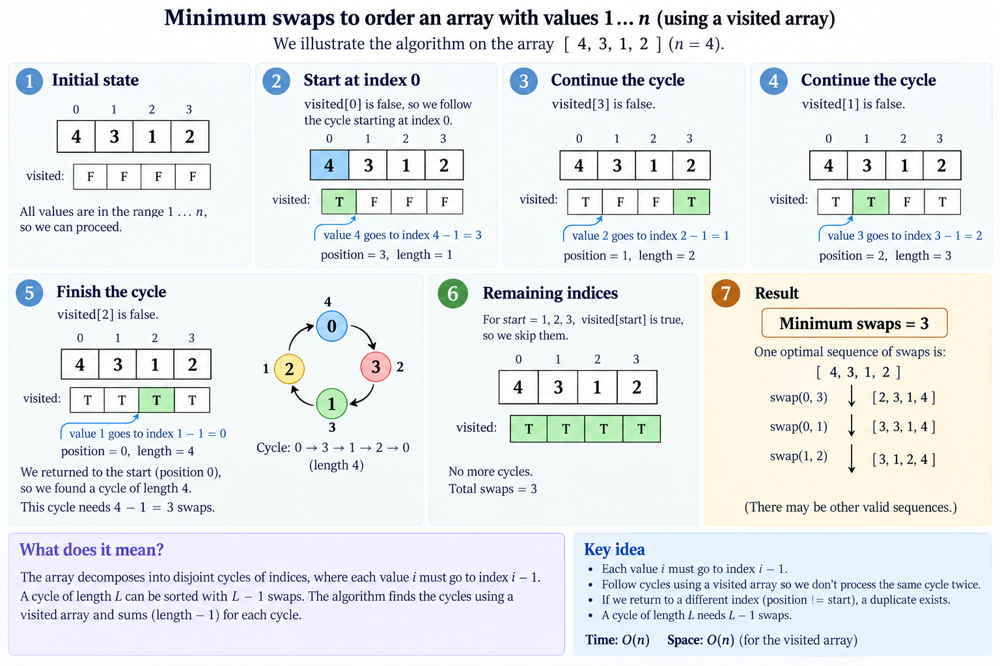
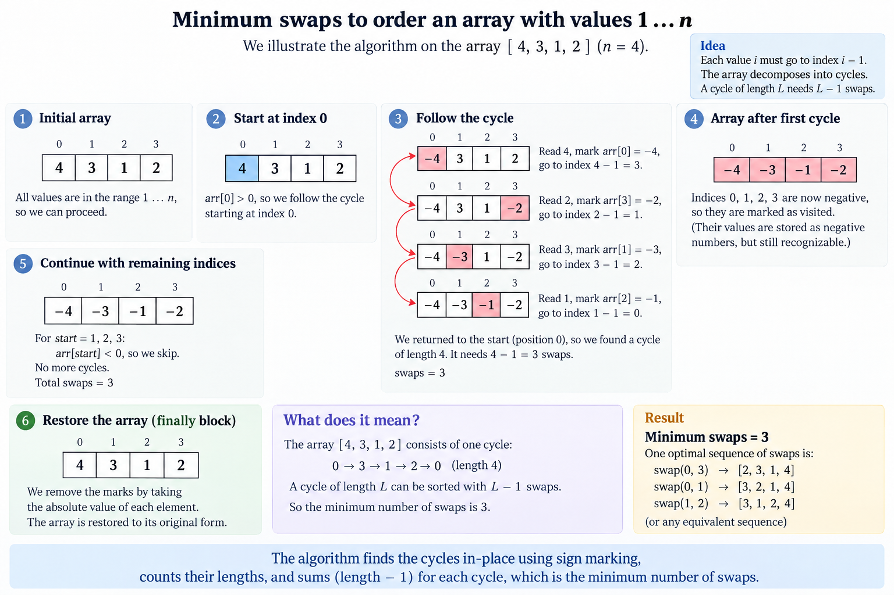
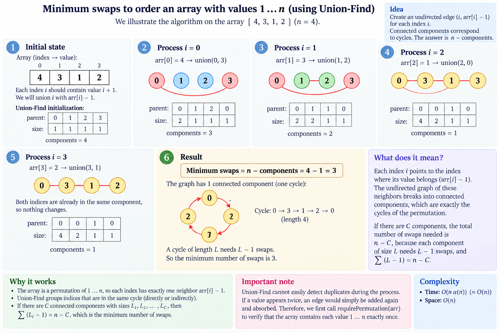

# Minimum Swaps — the answer is `n − cycles`, and no sort computes it

Notes for [`src/java/array/MinimumSwaps.java`](../../src/java/array/MinimumSwaps.java),
tested by [`test/java/array/MinimumSwapsTest.java`](../../test/java/array/MinimumSwapsTest.java).

**Problem** Given an array holding the consecutive integers `1, 2, … n` in some order and no
duplicates, return the fewest swaps of *any* two elements that sort it ascending. Samples:
`[4,3,1,2] → 3`, `[2,3,4,1,5] → 3`, `[1,3,5,2,4,6,7] → 3`. Constraints `1 ≤ n ≤ 10⁵`.

## The array is a permutation, not a list of numbers

The values are exactly `1 … n`, so `arr[i]` is not data — it is an **address**. Read it as one:

```
sigma(i) = arr[i] - 1        "whatever sits at i belongs at sigma(i)"
```

`sigma` is a permutation of `0 … n-1`, so it decomposes into disjoint cycles, and the whole problem
collapses to counting them:

```
minimum swaps = n - (number of cycles)
```

counting a fixed point as a cycle of length one. On the prompt's own worked example:

```
i         0  1  2  3  4  5  6
arr       7  1  3  2  4  5  6
sigma(i)  6  0  2  1  3  4  5

cycles    (0 6 5 4 3 1) (2)      c = 2      7 - 2 = 5
```

Five — which is exactly the number of swaps the prompt's walkthrough performs, and it is not a
coincidence that the walkthrough's swaps are the cycle being unwound one element at a time.

## Why `n − c`, in both directions

Everything rests on one lemma: **a single swap changes the cycle count by exactly one.**

| The swap | Effect on the cycles |
|---|---|
| two positions in the **same** cycle | splits it into two — `c + 1` |
| two positions in **different** cycles | merges them into one — `c - 1` |

There is no third case, and never a change of two. From that:

- **No fewer than `n − c`.** The sorted array is the permutation with `n` cycles (every element a
  fixed point). Starting from `c` cycles and gaining at most one per swap, reaching `n` takes at
  least `n − c` swaps.
- **No more than `n − c`.** A cycle of length `k` is sorted by `k − 1` swaps: send any one element
  home and a cycle of length `k − 1` is left behind. Summed over the cycles,
  `Σ(k_i − 1) = n − c`.

Upper and lower bound meet, so the count *is* the answer. Nothing is searched, nothing is compared,
and no ordering of the values is ever consulted — only their addresses.

The two extremes fall straight out: the sorted array has `n` cycles and costs `0`, and a single
cycle through every position costs `n − 1`, which is the worst any input can be.

## Swaps are not inversions

The obvious wrong answer is to sort and count the swaps. Bubble sort's count is the number of
**inversions**, which answers a different question, because bubble sort may only swap *adjacent*
elements. On the reversed array the two diverge as far as they possibly can:

| `n` | inversions (adjacent swaps only) | minimum swaps (any pair) |
|---:|---:|---:|
| 5 | 10 | 2 |
| 1 000 | 499 500 | 500 |
| 100 000 | ~5 × 10⁹ | 50 000 |

Quadratic against linear — `n(n-1)/2` against `floor(n/2)`. Restricting swaps to neighbours is not
a small restriction.

Selection sort, on the other hand, *is* optimal here, and the reason is the lemma above. Its step
`i` swaps the value `i + 1` home from wherever it is, which splits exactly one fixed point off the
cycle through `i`, and it only ever swaps when position `i` is not already correct — one swap, one
cycle gained, never a wasted move. `minimumSwapsInPlace` is that algorithm with the linear search
deleted: `arr[i]` already says where it belongs, so there is nothing to search for.

## Five ways to count the cycles

| Method | Time | Extra space | Array afterwards |
|---|---|---|---|
| `minimumSwaps` — `boolean[] visited` | O(n) | n bytes | untouched |
| `minimumSwapsInPlace` — cycle-leader swaps | O(n) | **O(1)** | **sorted** |
| `minimumSwapsMarkingSigns` — visited bit in the sign | O(n) | **O(1)** | untouched |
| `minimumSwapsByUnionFind` — cycles as components | O(n·α(n)) | 9n bytes | untouched |
| `minimumSwapsOfAnyDistinctValues` — sort, then rank | O(n log n) | 9n bytes | untouched |

### The visited bit is the entire design space

The first three are the same linear walk. They differ in one thing only — where the answer to
"have I been here already?" is kept:

- **in a side array** — n bytes, honest and obvious;
- **in the array's own sign bit** — no allocation at all, because the values are promised positive,
  so negating one marks its position without destroying it. The price is two more linear passes
  (validate, then restore) and an array that is visibly negative to any concurrent reader mid-call;
- **nowhere at all** — because the walk consumes the input. A position that has been visited is a
  position now holding its own value, and `arr[i] != i + 1` is the test. This is the only way to
  reach O(1) space in a single pass, and it costs the caller their array.

None of the three is faster in order terms. They are three different answers to "what may I spend?"

The first two, walked step by step on `[4, 3, 1, 2]` — the same single cycle
`0 → 3 → 1 → 2 → 0`, counted twice:



*`minimumSwaps` — the "have I been here?" bit lives in a side array.*



*`minimumSwapsMarkingSigns` — the same walk, with the bit borrowed from the array's own sign and
handed back by the `finally` block in step 6.*

## Measured

Ad hoc, `n = 10⁷`, best of five, JDK 25 — a throwaway harness, not reproduced by the build.

| shape, `n = 10⁷` | visited `boolean[]` | sign marking | in place | union-find | sort + rank |
|---|---:|---:|---:|---:|---:|
| **random permutation** | 641 ms | 593 ms | **565 ms** | 739 ms | 2 638 ms |
| one `n`-cycle, `sigma(i) = i+1` | 15 ms | 22 ms | **13 ms** | 125 ms | 526 ms |
| 5 × 10⁶ transpositions | 10 ms | 16 ms | **8 ms** | 67 ms | 528 ms |
| already sorted | 9 ms | 17 ms | **3 ms** | 16 ms | 473 ms |

**The side array is not free, and not only in bytes.** On a random permutation every step of the
walk is a cache miss, and `visited[]` adds a *second* randomly indexed stream on top of the one the
array already has. So the method that allocates 10 MB is also the **slowest** of the three linear
walks — and the sign trick, which pays for two extra full passes, still comes out ahead, because
those passes are sequential and prefetchable while the miss it avoids is not.

**Which reverses the moment memory gets easy.** Where the walk is already sequential —
`sigma(i) = i + 1`, or a field of transpositions — there are no misses for a second stream to
compete with, and the sign trick's two extra passes are simply two extra passes: 16 ms against
10 ms. The side array wins when memory is easy and loses when it is hard, which is the opposite of
what counting bytes predicts.

**Neither difference is large, and the other two columns are.** 641 ms against 565 ms is 13 %.
Union-find is never faster and is 8× slower where the walk is cheap, so its cost story really is
as bad as the table above claims. And dropping the `1 … n` promise costs **4×** on the same data —
2 638 ms against 641 ms — which is the honest price of having to sort to learn the ranks.

Note the last row: on already-sorted input the in-place walk does zero swaps in one pass with no
allocation, at 3 ms, while `sort + rank` still pays 473 ms for a sort it cannot skip.

## Union-find is dominated, and still worth keeping

Same linear order, nine times the memory, pointer-chasing where the others walk: on cost alone
`minimumSwapsByUnionFind` loses to everything above it. It is in the file for the question the cycle
walk cannot answer.



*The same `[4, 3, 1, 2]`, as components rather than a walk — and note the "Important note" panel:
union-find absorbs a repeated edge silently, which is why the method pays for a separate
`requirePermutation` pass.*

Every walk here assumes swaps are **unrestricted** — any two positions, any time. Drop that and the
cycle decomposition says nothing at all. Given instead a list of position pairs that *may* be
swapped, the components of that graph answer **reachability**: an element can arrive at a position
exactly when the two share a component, so the array is sortable if and only if every component
already holds the values belonging to its own positions, and the closest reachable arrangement is
each component sorted within itself.

What does **not** generalise is the count. `n − components` is *not* the restricted cost:

```
positions {0,1,2}, swaps allowed on (0,1) and (1,2)
  -> one component, so n - components = 2
[3,2,1] needs 3
```

and it has to be wrong, because adjacent-only swaps are exactly bubble sort, whose cost is the
inversion count — the point of the inversions section above. Counting swaps under a restricted
graph is the *token swapping* problem, and it is NP-hard in general; `n − c` is the special case
where the allowed-swap graph is complete. Union-find is what keeps saying something useful once it
is not.

## Beyond `1 … n`

Only one thing about a value ever mattered: **where it belongs** — its rank. The `1 … n` promise is
valuable precisely because it hands the ranks over for free (`arr[i] - 1`), which is what makes a
linear answer possible at all.

`minimumSwapsOfAnyDistinctValues` drops the promise and pays for it: sort a copy, binary-search each
value for its rank, then run the same cycle walk. O(n log n), dominated by the sort, and the
relabelling is why the test can take any permutation, push it through a strictly increasing function
and assert the answer does not move.

**Duplicates are genuinely out of scope**, not merely unhandled. With equal values there is no
single "where it belongs" — an element may be sent to any of its equals' destinations — so the
answer stops being *a* cycle count and becomes a maximisation of the cycle count over every valid
assignment. Different problem; the file rejects the input rather than quietly answering it.

### What the methods reject

The problem guarantees a permutation, so holding the caller to it is cheap insurance — and for the
in-place walk it is not optional: the textbook `while (arr[i] != i + 1) swap(...)` **spins forever**
on `[1, 1]`, because the swap it wants to make is a no-op.

The two O(1)-space walks get their check for free, from the traversal itself. In a real permutation
every position has exactly one predecessor, so a walk can only ever end by arriving back at its own
starting point. A duplicate leaves some position with no predecessor; that position is still
unvisited when its turn as a start comes round, and its walk necessarily ends somewhere else. One
`if (position != start)` is a complete duplicate detector.

Union-find cannot do this — it merges silently, absorbing a doubled edge without complaint — so it
pays for an explicit `boolean[] seen` pass. It had already spent the memory.

## Test oracles

Nothing rests on the implementation being its own witness, and one oracle in particular is
load-bearing:

| Oracle | Scale | Catches |
|---|---|---|
| **BFS from the sorted array** | **every** permutation of `n ≤ 8` — 40 320 at `n = 8` | `n − c` not being the *minimum* |
| Hand-written expected counts | 18 cases — all three samples, the walkthrough, the extremes | a wrong cycle count |
| Permutations built from a chosen cycle structure | 300 arrays up to `n = 200` | wrong handling of many/short cycles |
| Selection sort with the search left in | 300 random permutations, O(n²) | any cycle reasoning at all |
| Three fixed answers at 10⁷ | one `n`-cycle, 5M transpositions, arbitrary distinct values | overflow, depth, and scale |

The BFS is the one that proves the theorem rather than assuming it. Every other oracle — including
the naive selection sort — only confirms that `n − c` is **achievable**. A breadth-first search
outward from the sorted array, with a single swap of any two positions as the edge, returns the true
minimum by construction; permutations of up to eight elements pack into a `long` at four bits each,
so the whole of `S₈` fits in a `HashMap` and runs in under a second.

### Mutation check

Fifteen deliberate breaks, thirteen caught:

| Mutation | Caught by |
|---|---|
| a cycle costs `k` rather than `k − 1` | 23 failures |
| ranks replaced by raw indices | 21 |
| the sign walk ignores its own visited mark | 20 |
| `n − components` returned as `components` | 17 |
| `if` instead of `while` in the in-place walk | 8 |
| the sign restore pass deleted | 2 failures, 2 errors |
| the sign walk's closes-check deleted | 2 |
| the visited walk's closes-check, the in-place duplicate guard, the union-find permutation check, the distinctness check, the range check off by one | 1 each |
| the in-place walk swaps with `i + 1` instead of the value's home | **hangs** — `TimeoutException` at 30 s |

That last row is why the class is time-boxed at all: the break makes the in-place walk cycle two
elements forever on inputs every other method answers instantly, and before the timeout existed it
stopped the build rather than failing it.

The two survivors are equivalent mutants, not gaps: deleting union by size and deleting path
halving each remove a union-find optimisation without changing anything it computes.

```
mvn test -Dtest=MinimumSwapsTest
```
