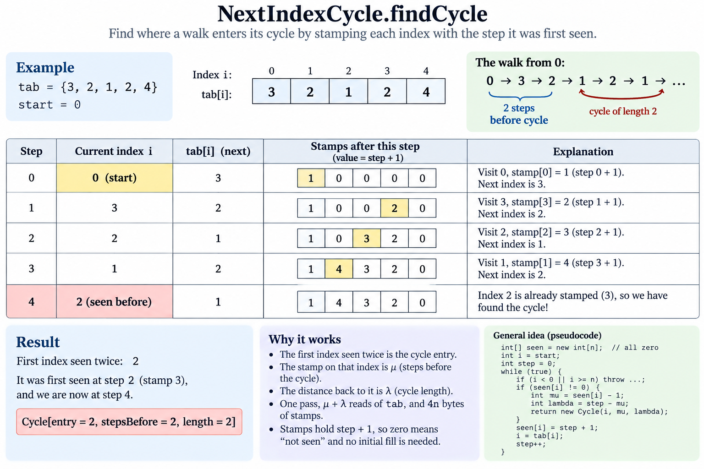
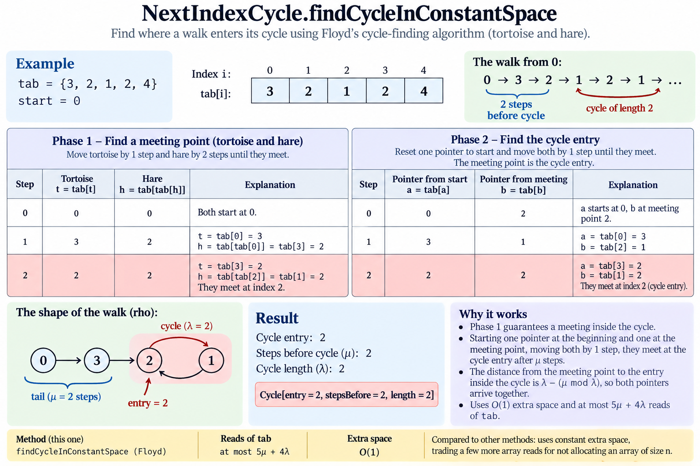

# Next-index cycle — the rho, and why constant space is also the fast one

Notes for [`src/java/array/NextIndexCycle.java`](../../src/java/array/NextIndexCycle.java),
tested by [`test/java/array/NextIndexCycleTest.java`](../../test/java/array/NextIndexCycleTest.java).

**Problem** Every element of `int tab[n]` holds the index of the next element. Starting at `start`,
determine when the walk begins to cycle and how long the cycle is. Sample: `tab = {3,2,1,2,4}`,
`start = 0`:

```
step  0    1    2    3    4    5
      0 -> 3 -> 2 -> 1 -> 2 -> 1 -> ...
                ^---------'
```

The cycle is entered at index 2, after 2 steps, and holds 2 indices.

## There is no "is there a cycle" to decide

`tab` is a function `f(i) = tab[i]` from `0 … n-1` into itself, and the walk is
`start, f(start), f²(start), …`. Two lines settle its shape for good:

- **It must repeat.** Only `n` values exist, so within `n+1` steps some index occurs twice.
- **Once it repeats, it repeats forever.** `f` is a *function* — one successor per index — so the
  step after a given index is always the same step. Returning to an index returns to its whole
  future.

So the walk is a **tail of `μ` steps that never comes back, then a cycle of `λ` indices, forever**:
the letter rho, drawn by the walk itself.

```
   start              entry
     o--o--o--o--o----->o----->o
                        ^      |        mu = 5 steps of tail, walked once and left behind
                        |      v        lambda = 4 indices of cycle, walked for ever
                        o<-----o
```

Every question about the walk is one of those two numbers. There is no acyclic case to report, no
search to cut short, and the first index reached twice is *necessarily* the entry — nothing earlier
can repeat, because an index on the tail has no way back.

**Two readings of "when".** The cycle *is entered* at step `μ = 2`; the repetition *becomes visible*
at step `μ + λ = 4`, when the walk stands on index 2 for the second time. `Cycle` carries `μ` as
`stepsBefore` and offers the other as `firstRepeatStep()`, because both are natural readings of the
question and mixing them up is the easiest way to be off by `λ`.

**Where the tail comes from.** [`MinimumSwaps`](minimum-swaps.md) walks cycles over a *permutation*,
and a permutation is exactly the case with no tail: every index has one predecessor, so no walk can
ever arrive at an index from two directions, and `μ = 0` wherever it starts. Here `f` is arbitrary —
index 2 in the sample is entered from both 3 and 1 — and that funnelling is the tail.

## Three ways to find μ and λ

| | Reads of `tab` | Extra space |
|---|---|---|
| `findCycle` — stamps | `μ + λ` | 4n bytes |
| `findCycleInConstantSpace` — Floyd | ≤ `5μ + 4λ` | **O(1)** |
| `findCycleByBrent` — Brent | ≤ `4(μ + λ) + 2` | **O(1)** |

Both bounds were checked exhaustively over every function on `n ≤ 7` indices from every start — no
violation, worst observed `4.29 (μ+λ)` for Floyd and `3.40 (μ+λ)` for Brent, both on a maximal tail
into a self-loop.

**Stamps.** Write into `firstSeen[i]` the step at which `i` was first stood on. The first index
found already stamped is the entry; its stamp is `μ`, and the distance from it to now is `λ`. One
pass, the fewest possible reads, and the only method that needs memory proportional to the *array*
rather than to the *walk*. The stamps hold the step **plus one**, so the zero of a fresh `int[n]`
already means "unseen" and no initialising pass is needed.

Stepped through on the sample, one row per step:



*`findCycle` — index 2 is reached again at step 4 carrying the stamp 3, so it was first stood on at
step 2. That is `μ`, and the distance back to it, `4 − 2`, is `λ`.*

**Floyd.** One pointer at one index per step, one at two. Both end up on the cycle; the fast one
gains a place per step, so it catches the slow one from behind. At the meeting, after `t` slow
steps:

```
the hare walked 2t, the tortoise t, and they stand on the same index
   =>  the difference 2t - t = t is a whole number of laps   =>  lambda divides t
```

That is the whole trick, and the rest reads off it. **Send one pointer back to `start` and walk both
one step at a time.** After `μ` steps the restarted one is at the entry; the other has walked
`t + μ`, which is `μ` plus whole laps, so it is at the entry too. They cannot have agreed earlier:
before step `μ` the restarted pointer is on the tail while the other — already `t ≥ μ` steps in — is
on the cycle, and the tail and the cycle share no index. So the first agreement is the entry, and
the step count is `μ`. One lap from there gives `λ`.

The same walk, in its two phases:



*`findCycleInConstantSpace` — the meeting point says nothing on its own; phase 2 is what turns it
into `μ`, and it is the restart at `start` that does the work.*

**Brent.** Park the tortoise and let the hare run: if the hare comes back to the parked index, the
distance it covered *is* `λ` — no second lap needed to measure it. The only question is how long to
let it run before re-parking, and the answer is to double the allowance each time: park at the
hare's position, allow `2^k` steps, then `2^(k+1)`. The first allowance that is both `≥ λ` and taken
from a spot on the cycle succeeds, and doubling reaches it in `O(log(μ+λ))` restarts while
overshooting by at most a factor of two. `μ` then needs no trick — put one pointer `λ` steps ahead
of another and walk them together; a lead of a whole lap is invisible on the cycle and unmistakable
on the tail, so they agree exactly at the entry.

The doubling is also the one place an `int` can overflow, at `power = 2^31`. Left alone it would be
harmless where the tortoise is already on the cycle and a hang where it is not (a tail longer than
`2^30`), so `power` saturates at `Integer.MAX_VALUE` instead — one comparison, on an array that
would need 4 GB to exist.

## Checked as it is walked, never up front

An element outside `0 … n-1` is an `IllegalArgumentException` rather than an
`ArrayIndexOutOfBoundsException` — but only when the walk actually reads it. Validating the array up
front would be O(n) *time*, which is exactly what the constant-space methods are for: on the
measurements below they touch some 1 200 elements of a million-element array. `{1, 0, 999}` from
`start = 0` is therefore answered, not rejected, and the documentation says so.

## What it costs

Measured ad hoc — not reproduced by the build. JDK 25.0.1 (Temurin), Intel i7-14650HX
(L2 24 MB, L3 30 MB), `tab` filled uniformly at random, 2 000 walks per row:

| n | `μ + λ` | stamps | Floyd | Brent | Brent / Floyd |
|---:|---:|---:|---:|---:|---:|
| 10³ | 36.6 | 36.6 | 144.9 | 111.7 | 0.77 |
| 10⁵ | 409.7 | 409.7 | 1 574.4 | 1 249.3 | 0.79 |
| 10⁶ | 1 216.6 | 1 216.6 | 4 815.7 | 3 791.5 | 0.79 |

Reads, not nanoseconds. Two things to take from it. **A rho is tiny compared to the array it lives
in**: for a random `f` both halves average `sqrt(pi n / 8)`, so `μ + λ ≈ 1.25 sqrt(n)` — 1 217 reads
in a million-element array, and the table's middle column is that formula measured. And **Brent
reads about four fifths of what Floyd does**, consistently: every step of Brent's reads once, where
Floyd's hare reads twice, and the lap is counted during the search instead of walked again after it.

The read counts are not the running time, because one of these methods allocates. Best of 5,
200 random starts, same random `tab`:

| n = 10⁷, random `tab` (`μ + λ ≈ 3 900`) | per call |
|---|---:|
| stamps | 1.66 ms |
| Floyd | **0.079 ms** |
| Brent | **0.084 ms** |

**21×**, and none of it is the walk. The walk is four thousand reads; the 40 MB of stamps is
allocated and zeroed for every call, and that is the entire measurement. This is the normal case —
a random `tab` always has a rho around `sqrt(n)` — and it is the reason the constant-space methods
are not merely a memory optimisation.

The obvious rebuttal is a rho as long as the array, where stamps read four times less. It does not
land either, as long as the walk is laid out sequentially:

| n = 10⁷, chain into a cycle (`μ = 8·10⁶`, `λ = 2·10⁶`) | per call |
|---|---:|
| stamps | 45.8 ms |
| Floyd | 27.8 ms |
| Brent | **22.6 ms** |

10⁷ reads lose to Floyd's 4.2·10⁷ (Brent's 2.8·10⁷), because a read is not what is being paid for.
This walk is `i → i+1`, so the prefetcher has every line ready before it is asked for and an extra
read is nearly free — while the 40 MB of stamps has to be allocated, zeroed and written whatever
the walk does.

Make the walk jump around memory instead, and the ranking finally turns over — one cycle through a
shuffled permutation, `μ = 0`, `λ = n`:

| n = 10⁷, one random n-cycle | per call |
|---|---:|
| stamps | **875 ms** |
| Floyd | 1 604 ms |
| Brent | 2 104 ms |

Every read is now a cache miss, and prefetching has nothing to predict, so what decides is the
number of reads that *depend on the one before* — `λ` for the stamps (the stamp writes are
independent of the walk and overlap with it), about `3λ` for Floyd, nearer `4λ` for Brent. It is
also the one table where Brent loses to Floyd despite reading less: Floyd advances two independent
pointers, so more than one miss is in flight at a time, while Brent's single hare is a pure
dependent chain. Against the constant-space methods' 21× on a random `tab` and 1.6× on the chain,
the stamps take this one back by 1.8×.

**In short:** stamps when the walk is known to cover a large part of the array *and* the array is
too scattered to prefetch; otherwise Floyd or Brent, which never allocate and, in the case anyone
actually hits, are also twenty times faster.

## Test

The load-bearing test is exhaustive: **every function on up to six indices, walked from every
start** — 50 069 arrays, 296 675 walks — each result checked against the *definition* rather than
against another implementation. Given `(entry, μ, λ)` it verifies that the walk stands on `entry`
after `μ` steps, that `λ` is the smallest number of steps returning `entry` to itself, and that
nothing the walk touched earlier is on that cycle. Those three admit exactly one answer, so it is an
oracle and not a weaker restatement of the code. The three implementations are then required to
agree with each other, and the walk returned by `walkToFirstRepeat` to follow `tab` and close where
the record says it closes.

Six indices is enough to hold every shape that exists: no tail and a maximal one, a self-loop, a
cycle over everything, several components, unreachable indices.

**At the other end of the range**, one test walks fifty million indices — 200 MB of ints, in the
512 MB heap surefire runs this build in. It asks only the constant-space methods, because
`findCycle` would want a second 200 MB for its stamps, and the one array serves twice, overwritten
in place rather than allocated again: first as a rho as long as itself (`μ = 4·10⁷`, `λ = 10⁷`,
which costs Floyd 2.1·10⁸ reads and Brent 1.7·10⁸), then filled at random, where the rho collapses to a few
thousand steps and the test holds it to under a thousandth of the array. Those are the two regimes
the measurements above are about, asserted rather than timed.

**Every test is time-boxed on a thread of its own** — `@Timeout(30, SEPARATE_THREAD)` on the class —
because the characteristic failure of a cycle walk is not a wrong answer but an endless one. Let
Floyd's hare take one step instead of two and the two pointers keep a fixed distance apart round the
cycle for ever, so nothing is ever asserted. That is not hypothetical — it is one of the mutations
below — and without the time-box it stops the build rather than failing it.

### Mutation check

Eleven deliberate breaks, ten caught:

| Mutation | Caught by |
|---|---|
| the stamp records the step after it is taken, not before | 21 failures |
| `μ` read straight off the stamp, without the offset | 14 failures, 7 errors |
| Floyd counts the closing lap from zero | 14 failures, 6 errors |
| Brent does not reset the lap counter when it re-parks | 11 failures, 7 timeouts |
| Floyd never sends a pointer back to `start` | 11 failures |
| Brent skips the `λ`-step lead before it hunts for `μ` | 11 failures |
| `walkToFirstRepeat` returns one index too few | 6 failures |
| `nextOf` stops checking that an element is an index | 1 failure |
| `Cycle` accepts a length of zero | 1 failure |
| **Floyd's hare takes one step instead of two** | **15 timeouts** — `TimeoutException` at 30 s, seven and a half minutes of them |
| the empty array is not rejected explicitly | **survives** |

The survivor is an equivalent mutant rather than a gap: when the array is empty, `start >= tab.length`
is true of every `start`, so the walk is refused with or without the check. Only the message differs,
and the check is kept for it.

The two timeout rows are the ones worth reading together. Both mutations leave a pointer chasing
something it can never catch, and neither produces a wrong answer — they produce no answer at all.
Without the class time-box they do not fail the build, they stop it.

```
mvn test -Dtest=NextIndexCycleTest
```
