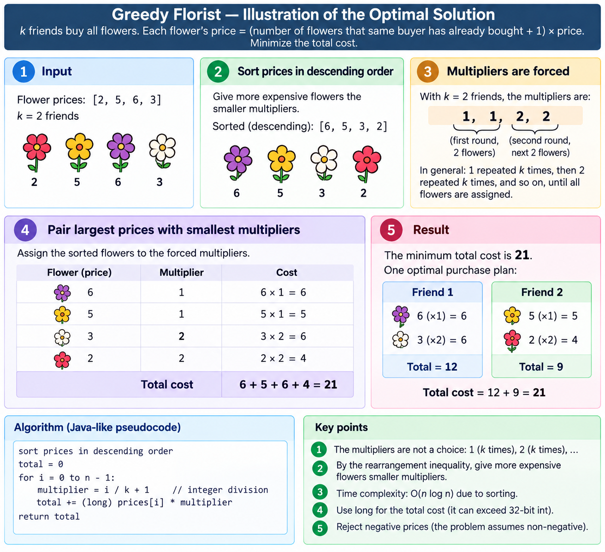

# Greedy Florist: mnożniki są wymuszone, więc wybieramy tylko parowanie

Notatka do [`src/java/greedy/GreedyFlorist.java`](../../src/java/greedy/GreedyFlorist.java),
testy: [`test/java/greedy/GreedyFloristTest.java`](../../test/java/greedy/GreedyFloristTest.java).

**Zadanie.** `k` przyjaciół kupuje razem `n` kwiatów. Kwiat kosztuje swoją cenę katalogową razy jeden
więcej niż liczba kwiatów, które _ten sam kupujący_ już kupił: pierwszy kwiat kosztuje `c`, drugi
`2c`, trzeci `3c`. Kup wszystkie jak najtaniej. Przykłady: `k=3, [2,5,6] → 13`;
`k=2, [2,5,6] → 15`; `k=3, [1,3,5,7,9] → 29`.

> Blok ograniczeń nie przetrwał wklejenia. Zwykłe ograniczenia tego zadania to `1 ≤ n, k ≤ 100` i
> `1 ≤ c[i] ≤ 10⁶`; nic w implementacji od nich nie zależy, a sekcja o przepełnieniu niżej dotyczy
> tego, co dzieje się _w ich obrębie_.

## Dwa lematy i nic więcej

### 1. Mnożniki nie są wyborem

Każdy przyjaciel ma dokładnie jeden _pierwszy_ zakup, więc w całej grupie najwyżej `k` kwiatów może
mieć mnożnik 1. Najwyżej `k` może mieć 2, najwyżej `k` mnożnik 3, więc najwyżej `m · k` kwiatów może
mieć mnożnik `m` lub mniejszy. To ogranicza każdy możliwy sposób zakupu.

Jeden sposób spełnia wszystkie te ograniczenia naraz: rozdaj `k` kwiatów po ×1, potem `k` po ×2 i tak
dalej. Skoro jest punktowo optymalny i osiągalny, zbiór mnożników jest ustalony, zanim spojrzymy na
jakąkolwiek cenę:

```
1, 1, ... 1,   2, 2, ... 2,   3, 3, ... 3,  ...        (po k każdego, aż skończą się kwiaty)
```

### 2. Przy danych mnożnikach parowanie to nierówność o przestawieniu

Załóżmy, że droższy kwiat ma _większy_ mnożnik niż tańszy: ceny `c_a > c_b`, mnożniki `m_a > m_b`.
Zamień je. Koszt zmienia się o

```
(c_a·m_b + c_b·m_a) - (c_a·m_a + c_b·m_b)  =  (m_b - m_a)(c_a - c_b)  <  0
```

czyli jest ściśle niższy, więc żaden optymalny zakup nie zawiera takiej pary. Najdroższy kwiat bierze
najmniejszy mnożnik, a odpowiedź to

```
koszt = suma po i z   descending[i] * (i / k + 1)
```

Na przykładzie 2, `k = 3`:

```
malejąco      9    7    5    3    1
mnożnik      x1   x1   x1   x2   x2
koszt         9  + 7  + 5  + 6  + 2   =  29
```

Oba lematy od początku do końca na `[2, 5, 6, 3]` z `k = 2`: posortuj, odczytaj wymuszone mnożniki,
sparuj największą cenę z najmniejszym mnożnikiem:



_Plan zakupów w panelu 5 to ten, który zwraca `purchasePlan(2, {2, 5, 6, 3})`: przyjaciel 0 bierze
rangi 0 i 2 (`6`, potem `3`), przyjaciel 1 rangi 1 i 3 (`5`, potem `2`), a każdy kupuje droższy
kwiat wtedy, gdy jest dla niego jeszcze najtańszy._

## To zadanie naprawdę jest zachłanne

Warto to powiedzieć, bo jego sąsiad [`maxMin`](max-min.md) nie jest, a ta różnica to dokładnie to,
czego uczy zestawienie obu plików obok siebie.

| | `maxMin` | `GreedyFlorist` |
|---|---|---|
| Reguła przyrostowa? | brak: wylicza `n − k + 1` okien | **tak**: najdroższy pozostały kwiat → najtańszy pozostały mnożnik |
| Decyzje nieodwołalne? | nie ma czego decydować | **tak**, kwiat po kwiecie |
| Argument wymiany | dowodzi, że _przestrzeń poszukiwań_ się zwija | dowodzi, że _wybór_ nigdy nie jest błędny |
| Kształt | sortowanie, potem pełne przejście po przyciętej przestrzeni | własność wyboru zachłannego + dowód wymianą |

`GreedyFlorist` ma podręcznikowy kształt: lokalnie optymalna decyzja podjęta bez patrzenia w przód,
której globalną optymalność dowodzi się, pokazując, że każde odstępstwo da się wymienić z powrotem.
`maxMin` pożycza tylko technikę dowodu.

## Pięć metod

| Metoda | Czas | Dodatkowa pamięć | Tablica po wywołaniu |
|---|---|---|---|
| `getMinimumCost(k, int[])` / `(k, List)` | O(n log n) | 4n bajtów | nietknięta |
| `getMinimumCostAsLong(k, int[])` | O(n log n) | 4n bajtów | nietknięta |
| `getMinimumCostInPlace(k, int[])` | O(n log n) | 0 – 4n bajtów † | **posortowana** |
| `getMinimumCostByCounting(k, int[])` | **O(n + maxPrice)** | 4·maxPrice bajtów | nietknięta |
| `purchasePlan(k, int[])` | O(n log n) | 4n bajtów | nietknięta |

† Ten sam przypis co w [`max-min.md`](max-min.md): `Arrays.sort(int[])` alokuje pełny bufor `int[n]`
do scalania, gdy wykryje, że wejście to kilka posortowanych odcinków, więc „bez własnej kopii” to nie
to samo co „bez alokacji”.

`purchasePlan` zwraca, kto co kupuje, w kolejności zakupów: `plan[f][j]` jest kupowany za `j+1` razy
swoją cenę. To _jakiś_ optymalny plan, a nie _ten_ jeden: równe ceny i granica między blokami
mnożników zostawiają prawdziwe remisy.

### Wariant ze zliczaniem w ogóle nie sortuje

Argument potrzebuje przejścia po cenach od najdroższej do najtańszej, a to słabszy wymóg niż
posortowanie. Daje to wprost histogram: policz, ile kwiatów ma każdą cenę, a potem przejdź liczniki w
dół, rozdając mnożniki blokami po `k`. Bez porównań i bez porządkowania, tylko tabela.

## Pomiary

Doraźnie, JDK 25, `k = 1024`, jedna JVM na komórkę, 4 powtórzenia rozgrzewające, potem mediana z 9,
klonowanie wejścia poza pomiarem; jednorazowy program, nie odtwarzane przy budowaniu.

| | sortowanie kopii | sortowanie w miejscu | **zliczanie** |
|---|---:|---:|---:|
| `n = 10⁷`, ceny `0..10⁶`: **`n` ≫ zakres** | 102 ms | 99 ms | **32 ms** |
| `n = 10⁷`, ceny `0..10⁷`: **zakres = `n`** | 97 ms | 94 ms | 97 ms |
| `n = 10⁴`, ceny `0..10⁶`: **`n` ≪ zakres** | **0.5 ms** | **0.5 ms** | 0.9 ms |

Podręcznikowe zachowanie sortowania przez zliczanie, a punkt przecięcia wypada tam, gdzie wynika z
arytmetyki: przy `maxPrice ≈ n`. Powyżej histogram porządkuje 10 milionów kwiatów taniej, **3.2
razy**; na granicy wynik jest w granicach szumu; poniżej płacisz za milion kubełków, żeby posortować
dziesięć tysięcy kwiatów, i przegrywasz.

Dlatego metoda ma warunek wstępny _sprawdzany_, a nie tylko opisany: granica jest ostra, a nie
łagodna. Cena powyżej 10⁷ jest odrzucana, zamiast po cichu alokować tabelę 40 MB dla kilku kwiatów.

## Zwracany `int` przepełnia się w podanych ograniczeniach

To nie zastrzeżenie „poza ograniczeniami”. Weź najgorszy przypadek z samego zadania: jeden
przyjaciel, sto kwiatów, po milionie każdy:

```
10⁶ × (1 + 2 + ... + 100)  =  5 050 000 000
Integer.MAX_VALUE          =  2 147 483 647
```

Ponad dwa razy więcej, a `int` zawinąłby to do sumy _ujemnej_. `getMinimumCost` zachowuje sygnaturę
platformy i zawęża przez `Math.toIntExact`, więc rzuca wyjątek, zamiast kłamać;
`getMinimumCostAsLong` to metoda, którą naprawdę warto wołać. Mnożenie w przejściu też jest w `long`:
przy `n = 10⁷` sumy w pomiarach wyżej sięgają 1.6 × 10¹⁶.

## Ujemne ceny psują zadanie, nie tylko dowód

Lemat 1 zakłada, że mały mnożnik jest pożądany. Poniżej zera tak nie jest: ujemny kwiat jest tym
_tańszy_, im później go kupić, więc chciałoby się, żeby jeden przyjaciel zbierał kwiaty i podbijał
swój mnożnik:

```
c = {-10, 1},  k = 2

bloki po k (co mówi reguła zachłanna):   1×1 + (-10)×1  =  -9
jeden przyjaciel kupuje oba:             1×1 + (-10)×2  =  -19    <- lepiej
```

To nie jest drobne odstępstwo: cały argument o wymuszonych mnożnikach się wali. Każda metoda
odrzuca ujemną cenę, zamiast zwracać złą odpowiedź. Zero jest w porządku: darmowy kwiat nic nie
kosztuje przy dowolnym mnożniku, a lemat 1 potrzebuje tylko cen nieujemnych.

## Wzorce w testach

| Wzorzec | Skala | Co łapie |
|---|---|---|
| **Brutalne przeszukanie każdego przypisania kwiat→przyjaciel** | wszystkie `kⁿ`, `n ≤ 7`, `k ≤ 4` | fałszywość któregoś lematu |
| Ręcznie zapisane oczekiwane koszty | 13 przypadków, w tym wszystkie trzy przykłady | zły rozmiar bloku albo mnożnik |
| Wzór blokowy na niezależnie posortowanej kopii | 400 losowych tablic, `n ≤ 400` | zły kierunek przejścia |
| Kontrakt `purchasePlan` | 400 losowych planów | plan, który nie jest podziałem albo nie kosztuje tyle, ile twierdzi |
| Kontrprzykład `{-10, 1}` | jedna tablica | po cichu zniknięte odrzucanie ujemnych cen |
| 3 000 kwiatów po 10⁶ przy `k = 1` | jedna tablica | iloczyn, który zawija się przed dodaniem do sumy |
| Wzór zamknięty przy 10⁶, metody między sobą przy 5 × 10⁶ | | przepełnienie i skalę |

Kluczowe jest brutalne przeszukanie. Wylicza każdy sposób rozdania kwiatów przyjaciołom i nie zakłada
żadnego lematu, tylko to, że _u jednego_ przyjaciela mnożniki to wymuszone `1..t`, co jest prawdą z
definicji, a nie z argumentu. Wszystko inne w pliku zgodziłoby się z pewnym siebie, błędnym
rozmiarem bloku.

### Sprawdzenie mutacjami

Siedemnaście celowych uszkodzeń. **Piętnaście złapano w pierwszym podejściu, a dwa ocalałe okazały się
prawdziwą luką, a nie mutantami równoważnymi**; warto to zapisać, bo właśnie po to istnieje
testowanie mutacyjne.

Oba ocalałe usuwały rzutowanie `(long)` z mnożenia:

```java
total += (long) price * (bought / k + 1);     // jak w kodzie
total +=        price * (bought / k + 1);     // mutant: nadal się kompiluje, total to long
```

To, że `total` jest `long`, rozszerza _wynik_, więc iloczyn i tak najpierw zawija się w arytmetyce
`int`. Istniejący test przepełnienia tego nie zauważył, bo przepełniał tylko **sumę** (100 kwiatów ×
10⁶, jeden przyjaciel: 5.05 × 10⁹), a każdy pojedynczy iloczyn, najwyżej 10⁶ × 100, mieścił się
spokojnie w `int`. Dodanie jednej tablicy 3 000 kwiatów po 10⁶ przy `k = 1`, gdzie sam zakup numer
2148 przekracza `Integer.MAX_VALUE`, zabija oba. Z tym testem wynik to 17 z 17.

| Mutacja | Złapana przez |
|---|---|
| mnożnik zaczyna się od 0 | 19 błędów |
| mnożnik w przejściu ze zliczaniem przesunięty o jeden | 17 |
| długość wiersza planu zaokrąglana w dół zamiast w górę | 16 wyjątków |
| bloki po `k + 1` zamiast `k` | 13 |
| plan kupuje najpierw najtańsze kwiaty | 12 |
| przejście czyta od najtańszego | 11 |
| przejście ze zliczaniem idzie w górę | 9 |
| zamienione indeksy przyjaciela i zakupu w planie | 12 wyjątków, 2 błędy |
| usunięte sortowanie z `AsLong` i z `InPlace` | po 5 |
| przyjęte `k < 1`; rzutowanie `(int)` zamiast `toIntExact`; `InPlace` sprawdza po sortowaniu | po 2 |
| przyjęte ujemne ceny | 3 |
| usunięty limit ceny dla histogramu | 1 |
| **usunięte rzutowanie `(long)` w obu przejściach** | **po 1** |

```
mvn test -Dtest=GreedyFloristTest
```
