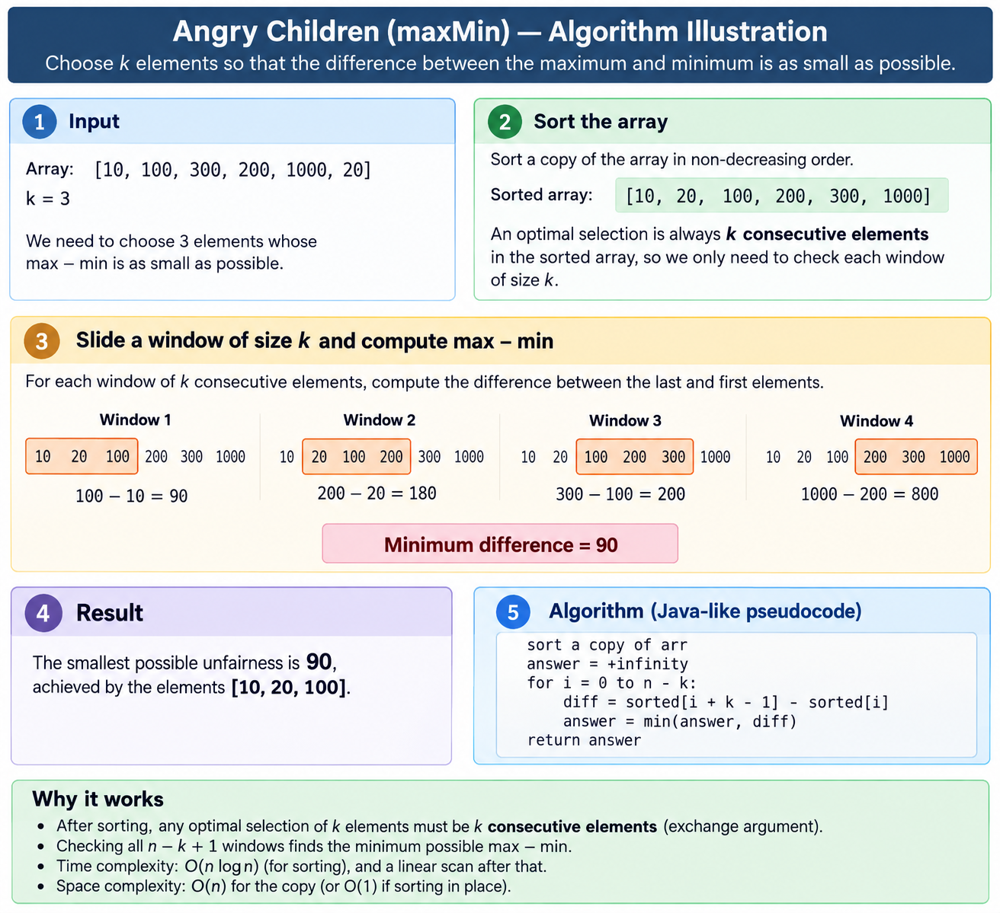

# Najmniejsza niesprawiedliwość: posortuj, potem przesuwaj okno `k`

Notatka do [`src/java/greedy/MaxMin.java`](../../src/java/greedy/MaxMin.java),
testy: [`test/java/greedy/MaxMinTest.java`](../../test/java/greedy/MaxMinTest.java).

**Zadanie** („Angry Children”). Dane są `arr[n]` i `k`; wybierz `k` elementów tak, żeby `max − min`
wybranych, czyli _niesprawiedliwość_, było jak najmniejsze. Przykłady:
`k=3, [10,100,300,200,1000,20,30] → 20`; `k=4, [1,2,3,4,10,20,30,40,100,200] → 3`;
`k=2, [1,2,1,2,1] → 0`. Wartości nie muszą być unikalne.

## `C(n, k)` wyborów, z których liczy się `n − k + 1`

Przy ograniczeniach zadania `C(n, k)` to liczba o dziesiątkach tysięcy cyfr. Jeden argument wymiany
odrzuca wszystkie poza liniowo wieloma.

**Optymalny wybór to `k` kolejnych elementów posortowanej tablicy.** Weź dowolny wybór; niech `m`
będzie jego najmniejszym elementem, `M` największym, a `i` indeksem `m` w posortowanej tablicy. Każdy
wybrany element jest `≥ m`, więc wszystkie `k` stoją na posortowanym indeksie `i` lub dalej, a
największy z nich na indeksie `i + k − 1` lub dalej. Zatem

```
M - m  >=  sorted[i + k - 1] - sorted[i]
```

a prawa strona sama jest poprawnym wyborem: oknem zaczynającym się w `i`. Żaden wybór nie bije więc
najlepszego okna, a każde okno da się wybrać. Zadanie to

```
odpowiedź = min po i z [0, n - k] z   sorted[i + k - 1] - sorted[i]
```

Na przykładzie 0, `k = 3`:

```
posortowane  10   20   30   100   200   300   1000
okna        [10   20   30]                            ->  20   <- najlepsze
                 [20   30   100]                      ->  80
                      [30   100  200]                 ->  170
                           [100  200  300]            ->  200
                                [200  300  1000]      ->  800
```

To samo przejście od początku do końca (posortuj, przesuwaj, weź najwęższe) na tablicy z przykładu 0
bez `30`, więc odpowiedź zmienia się na `90`:



_Cztery okna na sześciu elementach: `n - k + 1`, wobec `C(6, 3) = 20` wyborów, na które argument
wymiany nigdy nie musi patrzeć._

## Co tu znaczy „zachłanne”

Nie pętla „bierz najlepszy element”: takiej nie ma, a oczywiste reguły tego rodzaju są wszystkie
błędne. Na `[0, 10, 20, 30, 31, 32]` z `k = 3`:

| Reguła wyglądająca na zachłanną | Wybiera | Niesprawiedliwość |
|---|---|---:|
| `k` najmniejszych wartości | 0, 10, 20 | 20 |
| `k` wartości najbliższych średniej (20.5) | 20, 30, 31 | 11 |
| **najwęższe okno** | **30, 31, 32** | **2** |

Krok zachłanny to _wymiana_: każdy wybór da się przesunąć do środka na kolejne elementy bez
pogorszenia. To zwija przeszukiwanie do jednego liniowego przejścia i to jest cały algorytm. Do
zapłacenia zostaje tylko sortowanie.

## Sortowanie nie jest przypadkowe

Nie da się go uniknąć sprytniejszymi porównaniami. Przy `k = 2` odpowiedź to najmniejsza różnica
między dowolnymi dwoma elementami, a wynosi `0` **dokładnie wtedy, gdy tablica zawiera powtórzenie**.
Rozstrzygnięcie tego to problem różności elementów, który wymaga `Ω(n log n)` porównań, więc żadna
metoda oparta na porównaniach nie pobije sortowania w tym zadaniu, dla żadnego `k`.

`maxMinByRadixSort` jest szybsza tylko dlatego, że wychodzi poza ten model. Nigdy nie porównuje dwóch
wartości; indeksuje kubełki ich bitami, a tej informacji porównanie nie daje. Dolne ograniczenie
zostaje nietknięte, po prostu tu nie obowiązuje.

## Sześć metod, pięć profili kosztów

| Metoda | Czas | Dodatkowa pamięć | Tablica po wywołaniu |
|---|---|---|---|
| `maxMin(k, int[])` / `maxMin(k, List)` | O(n log n) | 4n bajtów | nietknięta |
| `maxMinAsLong(k, int[])` | O(n log n) | 4n bajtów | nietknięta |
| `maxMinInPlace(k, int[])` | O(n log n) | 0 – 4n bajtów † | **posortowana** |
| `maxMinByRadixSort(k, int[])` | **O(n)** | 8n bajtów | nietknięta |
| `fairestSelection(k, int[])` | O(n log n) | 4n bajtów | nietknięta |

`fairestSelection` zwraca same `k` elementów zamiast ich rozpiętości: dowód liczby, którą podają
pozostałe metody, i podzbiór (z powtórzeniami) wejścia.

† **`maxMinInPlace` nie alokuje własnej kopii, a to nie to samo co nie alokować niczego.**
`Arrays.sort(int[])` szuka rosnących odcinków przed podziałem, a na tablicy złożonej z kilku takich
odcinków scala je, do świeżo zaalokowanego `int[n]`. Zmierzone przez
`getCurrentThreadAllocatedBytes` przy `n = 10⁷`:

| wejście `Arrays.sort(int[])` | alokuje |
|---|---:|
| już posortowane (jeden odcinek) | 0 bajtów |
| losowe | ~2 MB (indeks odcinków, zanim się podda) |
| dwie posortowane połowy sklejone | **40 MB: dokładnie `n` intów** |
| dziesięć posortowanych odcinków | **40 MB** |

Kopia, której ta metoda unika, wraca więc dokładnie wtedy, gdy wejście jest częściowo uporządkowane,
co w prawdziwych danych jest częste, i dokładnie wtedy, gdy sięga się po wariant w miejscu. `8n`
sortowania pozycyjnego to jedyna wartość pamięci w pliku, która nie zależy od kształtu danych.

## Pomiary

Doraźnie, `n = 10⁷`, `k = 5 × 10⁶`, JDK 25, jedna JVM na komórkę, 4 powtórzenia rozgrzewające, potem
mediana z 9, klonowanie wejścia poza pomiarem; jednorazowy program, nie odtwarzane przy budowaniu.

| kształt | samo `Arrays.sort` | sortowanie kopii | sortowanie w miejscu | **sortowanie pozycyjne** |
|---|---:|---:|---:|---:|
| losowy `int` z pełnego zakresu | 76 ms | 82 ms | 77 ms | **57 ms** |
| `0 .. 10⁹` (zakres zadania) | 78 ms | 84 ms | 79 ms | **58 ms** |
| `0 .. 999` (mało różnych wartości) | 40 ms | 41 ms | **34 ms** | 72 ms |
| już posortowane | 2 ms | 8 ms | **4 ms** | 227 ms |

**Asymptotycznie lepszy algorytm wygrywa 1.4 razy i przegrywa 27 razy.** To cała lekcja tej tabeli.
`O(n)` wobec `O(n log n)` przy `n = 10⁷` obiecuje mniej więcej 23 razy; wychodzi 57 ms wobec 82 ms, bo
`log n` mnoży się przez bardzo małą stałą w dobrze dostrojonym quicksorcie, a każde przejście
sortowania pozycyjnego czyta i rozrzuca 40 MB.

**A sortowanie pozycyjne jest ślepe na uporządkowanie, i tu przegrywa.** Sortowanie z JDK wykrywa
istniejące odcinki i na już posortowanym wejściu prawie od razu kończy (8 ms z kopią, 2 ms bez), a
sortowanie pozycyjne płaci pełne trzy przejścia niezależnie od tego (czwarte jest pomijane: każda
wartość tutaj jest poniżej 2²⁴, więc najstarszy bajt jest jednolity). 227 ms wobec 8 ms to **27 razy
gorzej** na wejściu, które sortowanie przez porównania uważa za najłatwiejsze. Dane z małą liczbą
różnych wartości to łagodniejsza wersja tej samej historii: sortowanie przez porównania _przyspiesza_,
gdy przybywa powtórzeń (40 ms wobec 76 ms), a koszt sortowania pozycyjnego zależy tylko od tego, ile
pozycji bajtów się zmienia, więc różnica się zamyka, a potem odwraca.

**Kopia kosztuje około 4 ms**, czyli całą różnicę między „sortowaniem kopii” a „sortowaniem w miejscu”
w każdym wierszu. `maxMinInPlace` broni się pamięcią, a nie czasem, ale tylko na wejściu, którego
sortowanie z JDK nie zdecyduje się scalać (zob. przypis wyżej). Żaden z czterech zmierzonych kształtów
tego nie wywołuje i właśnie dlatego tabeli czasów nie można czytać jak tabeli pamięci.

## Poza ograniczeniami zadania

Ograniczenia obiecują `0 ≤ arr[i] ≤ 10⁹`, więc rozpiętość zawsze mieści się w `int`. Nic tu na tym nie
polega, bo błąd, gdy przychodzi, jest cichy:

```
{Integer.MIN_VALUE, -1, Integer.MAX_VALUE}, k = 2

 w int:   MAX_VALUE - (-1)        zawija się do -2147483648   <- "najwęższe okno"
 w long:  2147483648              po prostu szersze niż druga para
```

Odejmowanie w `int` nie tylko traci tu dokładność, ale odwraca porównanie i zwraca _ujemną_
niesprawiedliwość. Każde odejmowanie jest w `long`. `maxMin` zachowuje zwracany `int` z platformy i
zawęża przez `Math.toIntExact`, więc naprawdę za duża odpowiedź rzuca wyjątek, zamiast kłamać;
`maxMinAsLong` to metoda do wywoływania, gdy wartości są dowolne.

Pozostałe krawędzie: `k = 1` to zawsze `0`, `k = n` nie zostawia wyboru, a `k < 1` albo `k > n` to
`IllegalArgumentException`, sprawdzany _przed_ sortowaniem w `maxMinInPlace`, więc odrzucone
wywołanie nie może przestawić tablicy wywołującego.

## Wzorce w testach

| Wzorzec | Skala | Co łapie |
|---|---|---|
| **Brutalne przeszukanie wszystkich `C(n,k)` wyborów** | **każde** `k`, każda tablica `n ≤ 10` | fałszywość argumentu wymiany |
| Ręcznie zapisane oczekiwane odpowiedzi | 16 przypadków, w tym wszystkie trzy przykłady | złe okno albo pomyłkę o jeden |
| `Arrays.sort` + drugie, ręczne przejście | 400 losowych tablic, `n ≤ 300` | złą granicę przejścia |
| Zgodność dla każdego `k` na wejściu przechodzącym przez zero | `MIN_VALUE`, `MAX_VALUE`, liczby ujemne | bajt znaku czytany w sortowaniu pozycyjnym bez znaku |
| Kontrakt `fairestSelection` | 400 losowych tablic | dowód, który nie jest podzbiorem albo nie ma `k` elementów |
| Stałe odpowiedzi przy 10⁷ | potasowana tożsamość i po 10⁴ kopii każdej wartości | skalę |

Kluczowe jest brutalne przeszukanie. Każda metoda tutaj _zakłada_, że odpowiedź leży w oknie kolejnych
posortowanych elementów; wyliczanie wyborów maską bitową nie zakłada niczego, więc to jedyny test,
który przetrwałby, gdyby argument wymiany okazał się fałszywy. Wszystko inne zgodziłoby się z pewną
siebie, błędną implementacją.

### Sprawdzenie mutacjami

Siedemnaście celowych uszkodzeń, szesnaście złapanych:

| Mutacja | Złapana przez |
|---|---|
| koniec okna czytany na `k` zamiast `k − 1` | 26 wyjątków |
| przejście zachowuje _najszersze_ okno | 23 błędy |
| usunięta suma prefiksowa po kubełkach | 19 |
| usunięte sortowanie z `maxMinAsLong` | 15 |
| każde przejście sortowania pozycyjnego pomijane jako „jednolite” | 13 |
| przejście kończy się o jedno okno za wcześnie | 11 |
| `maxMinInPlace` nie sortuje | 11 |
| bajt znaku czytany bez znaku i odwracanie każdego bajtu zamiast jednego | po 8 |
| usunięte najstarsze przejście sortowania pozycyjnego | 6 |
| `fairestSelection` zwraca pierwsze okno zamiast najlepszego | 6 |
| rozpiętość odejmowana w `int` | 3 |
| przyjęte `k < 1`; przyjęte `k > n`; rzutowanie `(int)` zamiast `toIntExact` | po 2 |
| `maxMinInPlace` sprawdza _po_ sortowaniu | 1 |

Wiersz „rozpiętość odejmowana w `int`” jest cienki, i uczciwie: zawinięcie wymaga tablicy obejmującej
ponad połowę zakresu `int`, czego ograniczenia samego zadania nie dopuszczają. Trzy testy do niego
docierają, bo trzy zostały po to napisane.

Jedyny ocalały to mutant równoważny, a nie luka: usunięcie sprawdzenia „to przejście niczego nie
przestawi” każe sortowaniu pozycyjnemu wykonywać zawsze wszystkie cztery przejścia, wolniej, ale z
identycznym wynikiem.

```
mvn test -Dtest=MaxMinTest
```
