# Dwie windy, dwadzieścia pięter: przechowywanie żądań, wybór windy, kolejność przystanków

Notatka do [`src/java/greedy/TwoElevators.java`](../../src/java/greedy/TwoElevators.java),
testy: [`test/java/greedy/TwoElevatorsTest.java`](../../test/java/greedy/TwoElevatorsTest.java).

**Zadanie.** Budynek ma 20 pięter, numerowanych od 0 (parter) do 19, i dwie windy. Ludzie wzywają
windę z korytarza przyciskiem w górę albo w dół, a piętro wybierają w kabinie. System musi rozstrzygnąć
trzy rzeczy: jak przechowywać żądania, która winda odpowiada na wezwanie i w jakiej kolejności winda
odwiedza piętra. Musi brać pod uwagę, w którą stronę jedzie każda winda, i powiedzieć, które z dwóch
rozwiązań jest wydajniejsze.

Odpowiedź wynika z symulacji, krok co sekundę, z liczbami zamiast opinii:

| | |
|---|---|
| Piętra | 20 (0–19), na każdym przycisk w górę i w dół (na 0 tylko w górę, na 19 tylko w dół) |
| Windy | 2, po 8 osób |
| Jazda | 2 s na piętro (około 1,5 m/s przy kondygnacjach po 3 m) |
| Postój | 5 s na drzwi plus 1 s na każdą wsiadającą i wysiadającą osobę |
| Ruch | przyjścia Poissona przez godzinę, w czterech wzorcach (niżej), każdy wynik uśredniony po 20 godzinach |

## Krótka odpowiedź

- **Trzymaj żądania jako zbiory, nie jako kolejkę.** Jeden bit na piętro dla każdego przycisku, a 20
  pięter mieści się w `int`. Jedyna prawdziwa kolejka to ludzie stojący na jednym piętrze, czekający
  na jazdę w jedną stronę.
- **Ustalaj kolejność przystanków przez zamiatanie (LOOK).** Jedź dalej, dopóki cokolwiek jest przed
  windą, stawaj wszędzie, gdzie po drodze można kogoś obsłużyć, i zawracaj dopiero, gdy przed windą nic
  nie zostało.
- **Dawaj wezwanie windzie, która dojedzie pierwsza (ETA)**, biorąc pod uwagę jej kierunek i już
  obiecane przystanki, a nie windzie, która akurat jest najbliżej.
- **LOOK z ETA miało najkrótsze średnie czekanie i najkrótszą średnią podróż we wszystkich ośmiu
  zmierzonych ustawieniach** (cztery wzorce ruchu, dwa obciążenia). Przy czterech osobach na minutę
  pobiło naiwną kombinację od 2.2 do 27 razy w średnim czekaniu, a przy średnim czekaniu poniżej
  minuty obsługuje mniej więcej dwa razy większy ruch (osiem osób na minutę wobec czterech).
- Ceną jest sprawiedliwość przy małym ruchu. Ścisła kolejka obsługuje ludzi po kolei, więc jej
  _najdłuższe_ czekanie może być krótsze; pokazują to trzy z czterech wzorców przy dwóch osobach na
  minutę.

---

## Dwa rodzaje żądań i dlaczego kolejka to dla nich zły kształt

**Wezwanie z piętra** to przycisk na korytarzu. Niesie piętro i kierunek: ktoś na 7 chce jechać w
dół. **Przycisk w kabinie** niesie tylko piętro, bo kierunek wynika z tego, gdzie jest winda.

Oczywisty model to kolejka żądań w kolejności zgłoszenia, a jest błędny na trzy sposoby:

- **Żądanie to fakt, nie zdarzenie.** Pięć osób wciskających „w dół” na piętrze 7 to jedno żądanie.
  Zapalony przycisk świeci, dopóki winda jadąca w dół nie otworzy tam drzwi, niezależnie od tego, ile
  razy go wciśnięto.
- **Kierunek ma znaczenie.** „W górę na 7” i „w dół na 7” to różne żądania, obsługiwane w różnych
  chwilach. Winda jadąca w górę, która staje na 7, nie może zabrać ludzi jadących w dół.
- **Kolejność przyjścia to zła kolejność obsługi.** Winda poproszona o 12, 5 i 9 powinna stanąć na
  5, 9 i 12, bo w tej kolejności je mija. O tym jest następna sekcja.

Stan to więc zbiór masek bitowych, jeden bit na piętro, a ludzie na każdym piętrze tworzą jedną
prawdziwą kolejkę na kierunek:



| Maska | Ustawiony bit `f` znaczy |
|---|---|
| `upButtons`, `downButtons` | świeci przycisk w górę albo w dół na piętrze `f` |
| `carCalls` (na windę) | ktoś w tej windzie chce na piętro `f` |
| `upCalls`, `downCalls` (na windę) | ta winda dostała wezwanie w górę albo w dół z piętra `f` |

Na bitach każde pytanie LOOK to jedna albo dwie operacje:

```java
static int above(int floor) { return ALL_FLOORS & (-1 << (floor + 1)); }   // piętra floor+1 .. 19
static int below(int floor) { return (1 << floor) - 1; }                   // piętra 0 .. floor-1

boolean anythingAhead = ((carCalls | upCalls | downCalls) & above(floor)) != 0;
int nextStopUp        = Integer.numberOfTrailingZeros(requests & above(floor));
```

## Pierwszeństwo: kogo obsłużyć najpierw

Przy LOOK z ETA pierwszeństwo sprowadza się do pięciu reguł:

1. **Najpierw ludzie w środku.** Przycisk w kabinie zatrzymuje windę zawsze, gdy mija to piętro,
   cokolwiek innego się dzieje.
2. **Zabiera cię tylko winda jadąca w twoją stronę.** Wezwanie z piętra bierze winda jadąca w jego
   stronę albo winda, która i tak zawraca na tym piętrze. Winda jadąca w górę mija kogoś, kto chce
   jechać w dół.
3. **Skończ przejazd.** Winda nigdy nie zawraca, dopóki cokolwiek jest przed nią. To też chroni przed
   głodzeniem: wezwanie przydzielone windzie zostanie obsłużone najpóźniej pod koniec jej trzeciego
   przejazdu (góra, dół, znowu góra), chyba że winda jest pełna za każdym razem, gdy przejeżdża.
4. **Pełna winda mija wezwania z pięter.** Postój nikogo by nie wpuścił, więc winda nie staje.
5. **Między windami wygrywa najwcześniejszy przyjazd.** Remis wygrywa winda o niższym numerze.

Jedna winda jako automat stanów. Każda strzałka jest sprawdzana raz na sekundę:

```
                      wezwanie na jej własnym piętrze
      ┌──────────┐ ─────────────────────────────▶ ┌────────────────┐
      │   STOI   │                                │ DRZWI OTWARTE  │  5 s, + 1 s na osobę
      └──────────┘ ◀───────────────────────────── └────────────────┘
         │    ▲  drzwi zamknięte, nic do roboty      │       ▲
 praca   │    │  nic nie          drzwi zamknięte,   │       │ dojechała na piętro,
 powyżej │    │  zostało          praca przed nią    │       │ na którym musi stanąć
lub niżej▼    │                                      ▼       │
      ┌────────────────────────────────────────────────────────────────┐
      │ JEDZIE w górę lub w dół, 2 s na piętro. Na każdym: stanąć tu?   │
      │ Jeśli nie, jedzie dalej, dopóki coś jest przed nią; jeśli nic,  │
      │ zawraca.                                                        │
      └────────────────────────────────────────────────────────────────┘
```

„Stanąć tu?” to cała reguła pierwszeństwa LOOK, jako kod:

```java
static boolean lookStops(int floor, Direction dir, int carCalls, int upCalls, int downCalls, boolean full) {
    int b = bit(floor);
    if ((carCalls & b) != 0) {
        return true;                                   // ktoś w środku wysiada: zawsze
    }
    if (full) {
        return false;                                  // nikt nie mógłby wsiąść
    }
    int all = carCalls | upCalls | downCalls;
    return switch (dir) {
        // wezwanie w drugą stronę obsługujemy tylko tam, gdzie winda i tak zawraca
        case UP -> (upCalls & b) != 0 || (downCalls & b) != 0 && (all & above(floor)) == 0;
        case DOWN -> (downCalls & b) != 0 || (upCalls & b) != 0 && (all & below(floor)) == 0;
        case NONE -> ((upCalls | downCalls) & b) != 0;
    };
}
```

Gdy winda stanie, najpierw ludzie wysiadają. Potem winda decyduje, w którą stronę odjedzie, i wsiadają
tylko ludzie jadący w tę stronę.

---

## Rozwiązanie pierwsze: kolejność, w jakiej winda odwiedza piętra (FIFO wobec LOOK)

**FIFO** jedzie do najstarszego żądania i nigdzie po drodze się nie zatrzymuje. Tym jest traktowanie
żądań jako kolejki. **LOOK** to klasyczny algorytm windy: zamiata w jedną stronę, stając wszędzie,
gdzie może kogoś obsłużyć, i zawraca przy ostatnim żądaniu, a nie na końcu szybu. (SCAN to wariant,
który zawsze jedzie do końca.)

Te same cztery osoby, jedna winda:


FIFO wiezie osobę jadącą na 5 obok jej piętra do 12 i z powrotem. Jej podróż trwa 52 s zamiast 18 s,
a cztery podróże razem 234 s zamiast 162 s. Wezwanie w dół z piętra 7 pokazuje działanie kierunku:
LOOK mija piętro 7 w drodze w górę bez zatrzymania, bo ta osoba chce jechać w dół, i zabiera ją w
drodze powrotnej.

LOOK nie jest sprawiedliwsze. Osoba jadąca na 12 wcisnęła pierwsza, a przy LOOK dojeżdża w 44 s
zamiast 32 s. LOOK zmniejsza sumę, każąc niektórym czekać dłużej. Tabele niżej pokazują ten sam
kompromis w skali.

`lookVisitsTheFloorsInTheOrderItPassesThem` i
`fifoVisitsThemInTheOrderTheyWerePressedAndCarriesPeoplePastTheirFloor` w testach przypinają obie
kolejności przystanków dla trzech osób z holu.

## Rozwiązanie drugie: która winda odpowiada (NEAREST wobec ETA)

**NEAREST** daje wezwanie z piętra windzie najmniej pięter dalej. **ETA** daje je windzie, która
_dojedzie_ pierwsza. Różnica to kierunek: winda piętro dalej, która właśnie minęła wzywającego, jadąc
w górę na 19, jest najdalej ze wszystkich.


ETA to nie wzór. Odtwarza własne reguły LOOK windy na kopiach jej masek, z dodanym nowym wezwaniem,
aż winda stanęłaby tam, jadąc we właściwą stronę. Dzięki temu uwzględnia kierunek, punkty zawracania i
każdy już obiecany przystanek:

```java
int eta(int target, Direction want) {
    int car = carCalls, up = upCalls, down = downCalls;
    if (want == Direction.UP) {
        up |= bit(target);
    } else {
        down |= bit(target);
    }
    int at = startFloor(), time = startDelay();        // dokończ trwający ruch albo postój
    Direction heading = dir;
    for (int moves = 0; moves <= 3 * FLOORS; moves++) {
        if (lookStops(at, heading, car, up, down, false)) {
            Direction leave = lookDeparture(at, heading, car & ~bit(at), up, down);
            if (at == target && leave == want) {
                return time;
            }
            time += STOP_ESTIMATE;                     // drzwi i kilka osób
            /* ...wyczyść to, co obsługuje ten postój, i odjedź w tę stronę... */
        }
        heading = lookNext(at, heading, car | up | down);
        at += heading.step;
        time += SECONDS_PER_FLOOR;
    }
}
```

Trzy przejazdy LOOK zawsze wystarczą: w górę do najwyższego żądania, w dół do najniższego, z powrotem
w górę do wzywającego. Dla windy FIFO ETA jest prostsze i gorsze: czas obsłużenia całej jej kolejki,
potem dojazd do wzywającego, bo dołączenie na koniec kolejki znaczy dokładnie to. Pełna winda dostaje
60 sekund kary, bo nie może stanąć dla nikogo, dopóki ktoś nie wysiądzie.

---

## Które rozwiązanie jest najwydajniejsze: pomiary

Cztery wzorce ruchu, w każdym jedna na dziesięć podróży odbywa się między dwoma wyższymi piętrami:

| Wzorzec | Kto jedzie |
|---|---|
| `UP_PEAK` | rano: 9 na 10 z parteru w górę |
| `DOWN_PEAK` | wieczorem: 9 na 10 w dół na parter |
| `INTER_FLOOR` | z dowolnego piętra na dowolne inne |
| `LUNCH` | 2 na 5 w dół na parter, 2 na 5 w górę z parteru, reszta między piętrami |

Każda tabela podaje średnie czekanie przy dwóch i czterech osobach na minutę. Pozostałe kolumny są dla
czterech na minutę. _Czekanie_ trwa od wciśnięcia przycisku na piętrze do wejścia do windy,
_podróż_ od wciśnięcia do wyjścia, a _przejechane piętra_ liczą obie windy przez godzinę, jako
przybliżenie zużycia energii. Najlepsza wartość w każdej kolumnie jest pogrubiona. W każdym przebiegu
wszyscy dojechali.

#### UP_PEAK

| Strategia | średnie czekanie, 2/min | średnie czekanie, 4/min | 95. percentyl | najdłuższe czekanie | średnia podróż | przejechane piętra |
|---|---:|---:|---:|---:|---:|---:|
| FIFO + NEAREST | 44.5 s | 545.4 s | 1 098 s | 1 494 s | 629.7 s | 1 800 |
| FIFO + ETA | 19.5 s | 34.2 s | 87 s | 154 s | 96.4 s | 2 388 |
| LOOK + NEAREST | 31.8 s | 102.9 s | 233 s | 323 s | 149.7 s | **1 221** |
| LOOK + ETA | **18.1 s** | **19.8 s** | **48 s** | **96 s** | **60.0 s** | 1 813 |

#### DOWN_PEAK

| Strategia | średnie czekanie, 2/min | średnie czekanie, 4/min | 95. percentyl | najdłuższe czekanie | średnia podróż | przejechane piętra |
|---|---:|---:|---:|---:|---:|---:|
| FIFO + NEAREST | 50.6 s | 125.3 s | 383 s | 551 s | 184.0 s | 1 747 |
| FIFO + ETA | 25.2 s | 45.9 s | 91 s | 138 s | 93.1 s | 2 440 |
| LOOK + NEAREST | 35.7 s | 56.5 s | 149 s | 402 s | 93.1 s | **1 443** |
| LOOK + ETA | **23.5 s** | **31.1 s** | **78 s** | **126 s** | **63.6 s** | 2 113 |

#### INTER_FLOOR

| Strategia | średnie czekanie, 2/min | średnie czekanie, 4/min | 95. percentyl | najdłuższe czekanie | średnia podróż | przejechane piętra |
|---|---:|---:|---:|---:|---:|---:|
| FIFO + NEAREST | 30.0 s | 88.1 s | 210 s | 402 s | 174.6 s | 2 312 |
| FIFO + ETA | 17.7 s | 70.0 s | 145 s | 231 s | 152.1 s | 2 403 |
| LOOK + NEAREST | 22.0 s | 41.2 s | 113 s | 154 s | 67.7 s | **1 784** |
| LOOK + ETA | **16.0 s** | **31.4 s** | **87 s** | **130 s** | **57.0 s** | 1 911 |

#### LUNCH

| Strategia | średnie czekanie, 2/min | średnie czekanie, 4/min | 95. percentyl | najdłuższe czekanie | średnia podróż | przejechane piętra |
|---|---:|---:|---:|---:|---:|---:|
| FIFO + NEAREST | 25.9 s | 53.8 s | 128 s | 204 s | 116.9 s | 2 336 |
| FIFO + ETA | 16.8 s | 42.1 s | 94 s | 152 s | 101.7 s | 2 437 |
| LOOK + NEAREST | 20.5 s | 32.3 s | 94 s | 133 s | 64.1 s | **1 922** |
| LOOK + ETA | **14.8 s** | **24.5 s** | **74 s** | **115 s** | **55.8 s** | 2 014 |

**LOOK z ETA wygrywa każdą kolumnę czekania i podróży przy czterech na minutę, w każdym wzorcu.** Ma
też najkrótsze średnie czekanie przy dwóch na minutę wszędzie. Test `lookWithEtaWaitsLeastOnAverage`
sprawdza to twierdzenie ponownie na dziesięciu godzinach, których tabele nie uśredniały.

**To, który z dwóch wyborów jest ważniejszy, zależy od obciążenia.**

- _Przy małym ruchu ważniejszy jest wybór windy._ Przy dwóch na minutę FIFO + ETA pokonuje LOOK +
  NEAREST w każdym wzorcu. Winda rzadko jest zajęta, więc o czekaniu decyduje to, czy wysłano
  właściwą.
- _Gdy ruch rośnie, przejmuje kolejność przystanków._ Przy czterech na minutę, między piętrami, samo
  LOOK skraca średnie czekanie z 88 s do 41 s, a samo ETA tylko do 70 s.
- _Wyjątkiem jest poranny szczyt, gdzie wybór najbliższej windy sam się sypie:_ 545 s przy FIFO,
  103 s przy LOOK, wobec 20 s dla LOOK + ETA. Nie chodzi o to, że jedna winda stoi bezczynnie: przy
  LOOK obie wiozą mniej więcej połowę pasażerów w obu przypadkach (53/47 wobec 50/50). Przy LOOK +
  NEAREST 29% czekających w holu obsłużyła winda, która w chwili wciśnięcia przycisku oddalała się od
  nich w górę, wobec 6% przy LOOK + ETA: to przypadek z rysunku wyżej. A ponieważ zapalony przycisk
  jest przydzielany raz, każdy, kto przyjdzie, gdy świeci, czeka na tę samą windę, więc jeden zły
  przydział opóźnia całą grupę.

**ETA więcej jeździ.** Przy tej samej kolejności przystanków przejeżdża o 4–48% więcej pięter niż
NEAREST, bo naprawdę używa wolnej windy, zamiast zostawiać ją tam, gdzie stoi. LOOK przejeżdża o
13–32% mniej pięter niż FIFO przy tym samym przydziale, bo nigdy nie wraca po piętro, które właśnie
minęło.

**Ogony przy małym ruchu to jedyna przewaga sprawiedliwej kolejki.** Przy dwóch na minutę najdłuższe
czekanie FIFO + ETA jest krótsze niż LOOK + ETA w trzech z czterech wzorców: 69 s wobec 86 s w
wieczornym szczycie, 62 s wobec 84 s między piętrami, 66 s wobec 77 s w porze lunchu. To przykład z
jedną windą w skali: zamiatanie każe pechowcom czekać na szczęściarzy. Przy czterech na minutę
wydajność zamiatania przeważa i ogony LOOK + ETA też są najkrótsze.

### Jaki ruch obsłuży każda strategia


| na minutę | FIFO + NEAREST | FIFO + ETA | LOOK + NEAREST | LOOK + ETA |
|---:|---:|---:|---:|---:|
| 2 | 25.9 s | 16.8 s | 20.5 s | **14.8 s** |
| 4 | 53.8 s | 42.1 s | 32.3 s | **24.5 s** |
| 6 | 110.0 s | 99.5 s | 45.0 s | **36.8 s** |
| 8 | 252.4 s | 222.1 s | 57.5 s | **50.7 s** |
| 10 | 524.7 s | 491.6 s | 82.2 s | **71.7 s** |
| 12 | 840.2 s | 819.3 s | 162.2 s | **134.8 s** |
| 14 | 1 194.7 s | 1 192.8 s | 335.9 s | **301.0 s** |
| 16 | 1 571.1 s | 1 552.9 s | 647.6 s | **528.8 s** |
| 18 | 1 945.1 s | 1 920.9 s | 888.0 s | **764.7 s** |
| 20 | 2 329.4 s | 2 301.1 s | 1 192.9 s | **991.5 s** |

Średnie czekanie w porze lunchu przy rosnącym ruchu. Winda FIFO spędza czas na zawracaniu, więc od
około sześciu na minutę przyjścia ją wyprzedzają: czekanie mniej więcej podwaja się z każdymi dwiema
osobami na minutę więcej, do dziesięciu, i dalej rośnie. LOOK + ETA zostaje poniżej dwóch i pół minuty
do dwunastu na minutę. Inaczej mówiąc: przy średnim czekaniu poniżej minuty FIFO radzi sobie z mniej
więcej czterema osobami na minutę, a LOOK z ośmioma. Powyżej około dwunastu na minutę nawet czekanie
LOOK + ETA rośnie o minuty z każdym krokiem. Ta krzywa mówi, że dwie windy po osiem osób nie udźwigną
tego ruchu, a rozwiązaniem jest trzecia winda, nie lepsza reguła.

**Z dwóch rozwiązań na każdej osi wydajniejsze są więc LOOK i ETA, a razem są najwydajniejsze z
czterech zmierzonych kombinacji.** Jedyną przewagą FIFO jest krótsze najdłuższe czekanie, gdy w
budynku jest spokojnie.

---

## Czego model nie uwzględnia

- **Wezwania są przydzielane raz.** Winda zatrzymuje wezwanie, dopóki go nie obsłuży, tak jak
  zapalona lampka na korytarzu obiecuje konkretną windę. Ponowny przydział co sekundę albo
  pozwolenie windzie przejeżdżającej we właściwą stronę na przejęcie wezwania innej windy jeszcze by
  ETA poprawiły.
- **ETA nie widzi przyszłości.** Nie wie, jakie piętra wcisną ludzie, których zabierze, i zakłada
  dwie osoby na postój.
- **Stojące windy zostają tam, gdzie stanęły.** Reguły parkowania, np. odesłanie jednej windy do
  holu przed porannym szczytem, to osobny i dobrze znany zysk.
- **Destination dispatch nie jest modelowany.** To nowszy projekt, w którym ludzie wpisują piętro
  docelowe na korytarzu, więc dyspozytor może grupować jadących w te same miejsca.
- Jazda ze stałą prędkością, drzwi zajmują stały czas, a pojemność to liczba osób.

---

## Uruchomienie

```sh
JAVA_HOME=~/.sdkman/candidates/java/25.0.1-tem mvn -q compile
java -cp target/classes greedy.TwoElevators          # wszystkie tabele powyżej, w około sekundę
JAVA_HOME=~/.sdkman/candidates/java/25.0.1-tem mvn test -Dtest=TwoElevatorsTest
```

Każda liczba na tej stronie pochodzi z `main`. Rysunki powstały z przebiegów samej symulacji: dwa
przykłady to scenariusze, które sprawdza `TwoElevatorsTest`, plus w pierwszym jedno wezwanie z piętra
7. Testy sprawdzają też, co musi zachodzić przy każdej strategii i każdym wzorcu:

- każdy wysiada na swoim piętrze i wsiada nie wcześniej, niż przyszedł;
- żadna winda nie wiezie więcej niż osiem osób;
- winda LOOK nigdy nie staje dla nikogo;
- podróż kosztuje dokładnie drzwi plus dwie sekundy na piętro.

Ostatni test istnieje, bo wczesna wersja symulacji przesuwała windy o jedno piętro na sekundę, a nic
innego tego nie zauważyło.
