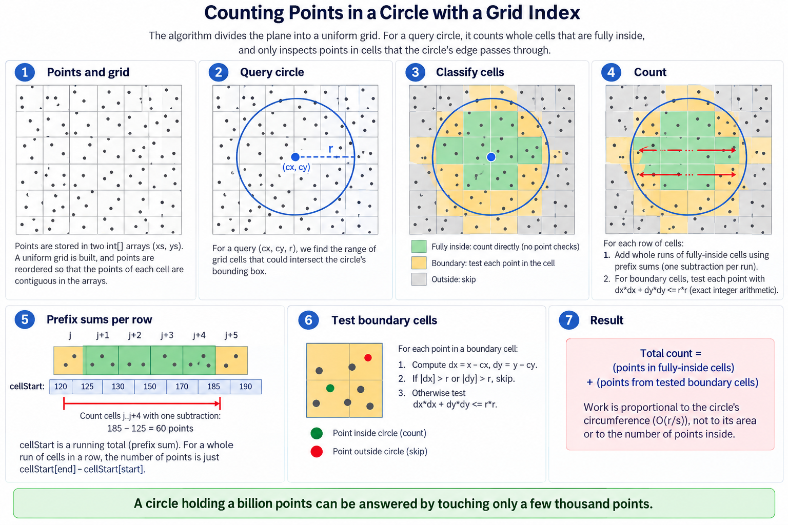

# Points in a circle — counting a billion of them without reading them

Notes for [`src/java/spatial/PointCloud.java`](../../src/java/spatial/PointCloud.java),
tested by [`test/java/spatial/PointCloudTest.java`](../../test/java/spatial/PointCloudTest.java).

**Problem** A constructor is given a vector of integer points in the plane — *billions* of them.
Write a method that takes a centre and a radius and returns how many of those points lie in that
circle.

*(The question is posed in C++, as `vector<pair<int,int>>`. This repository is Java, so the solution
is Java; the representation argument below is the same in both languages, and in Java it is worse.)*

## The word that decides everything is "billions"

Without it the answer is one line — test every point, `dx*dx + dy*dy <= r*r` — and that line is
still in the class, as `countInCircleByScan`, because for a *single* query it is the right answer:
nothing can beat one pass when one pass is all you were going to do.

With it, two things change before any algorithm is chosen.

**The points cannot be objects** — and here the Java translation of the question deserves care,
because the original does not have this problem. C++'s `vector<pair<int,int>>` *is* 8 bytes a point,
contiguous, with no headers and nothing to trace: exactly the layout you want. Java's nearest
equivalents are not.

| Two billion points as | Bytes each | Total |
|---|---:|---:|
| `List<int[]>` — a header and a reference per point | 32–40 | 64–80 GB |
| `List<Point>` / `Point[]` of a two-field record | ~32 | ~64 GB |
| **two `int[]`** | **8** | **16 GB** |

Object references stop being compressed past a 32 GB heap, which either of the first two rows
guarantees on its own, so those figures are the pessimistic end of their range rather than a
worst case. And every one of those objects is something the garbage collector must trace; the two
`int[]` are two objects, whatever is in them.

So the real constructor is `PointCloud(int[] xs, int[] ys)`, and it *takes the arrays over* rather
than copying them, because the copy is another 16 GB. `PointCloud.of(List<int[]>)` accepts the
question's own signature translated literally, and its javadoc says plainly that it is the wrong way
in at this size — the list costs more than the structure built from it.

**And a scan per query is hopeless.** A pass over two billion points is a couple of seconds of pure
memory bandwidth — fine once, absurd for a method that will be called again and again. Everything
below is about answering without touching the points.

## The index: a grid, and one array doing two jobs

The constructor sorts the points into a uniform grid of cells and keeps three arrays, and
nothing else at all:

```
xs, ys       the points, permuted in place so that one cell's points are contiguous
cellStart    cells + 1 running totals, row-major
```

`cellStart` is the whole trick, because it answers two different questions at once:

- read as **boundaries**, `cellStart[c] .. cellStart[c+1]` is where cell `c`'s points live in
  `xs`/`ys` — the ordinary CSR layout;
- read as what it is, a **running total**, `cellStart[b] - cellStart[a]` is *how many points lie in
  cells `a .. b-1`* — and because the grid is row-major, the cells of one row are consecutive, so a
  whole run of cells across a row is counted **in one subtraction**.

One array, no second structure, no per-cell objects: 4 bytes per cell on top of 8 bytes per point.
At 64 points to a cell that is an index of 0.8% — and the measurements below bear it out, at 58 MB
over 7.6 GB.

### Permuting in place

Sorting the points into cell order is a counting sort, and the textbook one writes into a second
pair of arrays — another 16 GB. Instead the points are cycled into place: take the first unfilled
slot of a cell, look at what is sitting there, and swap it with the first free slot of the cell it
belongs to. Every swap puts at least one point where it finally belongs, so the permutation is O(n)
swaps and costs 4 bytes per *cell* of scratch, not per point.

## The query: pay for the circumference, not the area

The whole of it in one picture — the grid, the three kinds of cell, and the subtraction that counts
a run of them:



*Green is counted whole, out of `cellStart`, without a single point being read. Yellow is where the
edge falls, and only those points are tested. Panel 5 is the subtraction that does the work.*

Now the detail. The circle is walked one row of cells at a time, and for a row two exact integer
distances decide everything — the nearest and the farthest the row's band of `y` gets from the
centre:

```
                          dyFar (this row's worst case)
   +---+---+---+---+---+---+---+---+
   | . | . | # | # | # | # | . | . |     # cells wholly inside: added as ONE subtraction
   +---+---+---+---+---+---+---+---+
     ^^^                       ^^^       cells the edge crosses: their points tested, one by one
```

- every point of a cell is inside the circle when the cell's **farthest corner** is, so the run of
  such cells is a contiguous range of columns, computed in closed form and added as a single
  `cellStart` subtraction — **however many millions of points it covers**;
- only the cells at the two ends of that run — the ones the circle's edge passes through — are
  opened up, and their points tested exactly;
- a row the circle misses entirely is skipped without arithmetic.

There are O(r/s) edge cells for radius `r` and cell size `s` — the perimeter measured in cells — so
the cost is proportional to the circle's **circumference** and to the points near it, never to its
area or to the points inside it. That is the sentence the whole class exists for: *a circle holding
a billion points is answered by reading about a thousandth of them* — measured below, 785 million
counted after opening some twelve thousand cells out of fifteen million.

`countInCircleByCells` is the same idea done the obvious way: visit every cell of the circle's
bounding box, add the whole count of the ones that are inside, test the points of the ones the edge
crosses. It also never reads the interior's points — it just still visits the interior's *cells*,
O((r/s)²) of them. Summing a row at a time is what removes that last proportionality to area, and
it is the only difference between the two methods.

## Integers all the way down

Two places where this is easy to get wrong, and both are tested.

**No square roots of distances.** A circle is `dx*dx + dy*dy <= r*r` and nothing else. The one root
taken is `isqrt` — how far the circle reaches in `x` at a given `y` — and it is corrected to an
exact integer floor, because `Math.sqrt` returns a double with 53 bits of mantissa for a value with
up to 62, and can land either side of the true root. A point exactly on the circle must be counted
by every method or by none.

**Overflow.** Coordinates span the whole of `int`, so `dx` between two of them can be `2³²`, which
no `int` holds, and `dx*dx` can be `2⁶⁴`, which no `long` holds either. Every distance test
therefore rejects on `|dx| > r` *before* it squares anything, which bounds the product to
`(2³¹−1)²` and the sum of two to just under `Long.MAX_VALUE`.

Both bugs the tests caught were of exactly this family, and neither was in the geometry.

**Choosing the cell size** compares `columns * rows` against a budget, and for a cloud spanning the
whole plane both sides are `2³²`, so the product is `2⁶⁴` — which a `long` reports as **nought**,
making the widest possible grid look like the smallest and producing a grid of no cells at all. The
comparison is a division now.

**Finding the run of wholly-inside cells** divides `cx - reach - minX` by the cell size, and that
numerator reaches `2³²` when the cloud sits at one end of the plane and the circle at the other. Cast
to `int` before it was clamped to the row's actual columns, it came back *negative*, and a negative
column reads behind the start of the running totals: the test that found it asked a cloud at
`MIN_VALUE` about a circle at `MAX_VALUE` and was told **12** points were in it rather than none — a
wrong answer, not a crash, which is the kind that survives. The clamp happens in `long`s now, and the
cast only once the value is known to be a column.

## Choosing the cell size

One knob, one trade. Cells are a power of two wide, so a cell index is a shift rather than a
division, and the constructor picks the smallest power of two whose grid fits a budget of about
`n / pointsPerCell` cells (default 64, capped at 2²⁶ cells = 256 MB of index).

| Smaller cells | Larger cells |
|---|---|
| fewer points dragged into the exact test at the edge | more |
| edge work falls linearly with `s` | rises linearly |
| index grows quadratically as `s` shrinks | shrinks quadratically |

64 points is a few cache lines: about the size at which opening a cell costs what one random memory
read costs anyway.

## Measured

Measured ad hoc — not reproduced by the build. JDK 25.0.1 (Temurin), Intel i7-14650HX, points
uniform over a 2·10⁶ × 2·10⁶ box, best of five, all three methods agreeing on every row.

**One billion points** — 7.6 GB of coordinates, generated in 7 s and indexed in 230 s into
15 264 649 cells of 65 points each, for **58 MB of index: 0.76% on top of the data**.

| radius | points found | `countInCircle` | `byCells` | `byScan` |
|---:|---:|---:|---:|---:|
| 1 000 | 753 | 0.044 ms | 0.050 ms | 337.9 ms |
| 10 000 | 78 155 | 0.033 ms | 0.148 ms | 356.2 ms |
| 100 000 | 7 852 517 | 0.364 ms | 0.935 ms | 382.6 ms |
| 500 000 | 196 341 681 | 1.812 ms | 10.276 ms | 530.9 ms |
| 1 000 000 | **785 404 930** | **3.901 ms** | 38.216 ms | 807.5 ms |
| 2 000 000 | **1 000 000 000** | **0.724 ms** | 36.702 ms | 802.0 ms |

Two rows are the answer to the question. **785 million points counted in 3.9 milliseconds** — 207×
faster than the scan, and the only points read were those in the cells the circle's edge passes
through, some twelve thousand cells out of fifteen million. And the last row, where the
circle swallows the plane: **the entire billion counted in 0.72 ms**, 1 100× faster than the scan,
because a circle with no edge inside the grid is nothing but row subtractions. The answer is
bigger, and the work is smaller.

`byCells` is the control. At `r = 1 000 000` it does the identical point tests and is 10× slower,
because that circle covers the whole grid: it visits all 15 million cells one at a time where
`countInCircle` does 3 906 row subtractions. That factor is the difference between "proportional to
the area" and "proportional to the circumference", measured.


Ten million points, for comparison — 60 025 cells of 166 points, built in 0.4 s:

| radius | points found | `countInCircle` | `byCells` | `byScan` |
|---:|---:|---:|---:|---:|
| 1 000 | 8 | 0.014 ms | 0.014 ms | 6.7 ms |
| 10 000 | 788 | 0.004 ms | 0.007 ms | 4.1 ms |
| 100 000 | 78 288 | 0.055 ms | 0.093 ms | 4.3 ms |
| 500 000 | 1 963 625 | 0.255 ms | 1.170 ms | 6.0 ms |
| 1 000 000 | 7 855 094 | 0.533 ms | 1.109 ms | 9.2 ms |
| 2 000 000 | 10 000 000 | **0.055 ms** | 0.161 ms | 8.5 ms |

Read the last row first: **the entire cloud counted in 55 microseconds**, because a circle that
covers everything has no edge inside the grid at all — every row is one subtraction. The row above
it is the one that makes the point about area: 7.9 million points counted in half a millisecond,
having opened only the cells along one circumference.

`byCells` tracks `countInCircle` closely while the circle is small and falls behind as it grows —
at `r = 500 000` it is 4.6× slower. It performs exactly the same point tests; what it does instead
of 122 row subtractions is visit all 122² ≈ 15 000 cells of the bounding box, one at a time. Both leave the scan far behind, and the scan's own timings barely move with the radius, which
is the tell: it is doing the same work every time regardless of what is being asked.

**When not to build the index.** The build is two passes over the points, and at ten million it
costs about what 100 scans cost; at a billion, 230 s, or about 600 scans — the permutation's writes
land at random in 7.6 GB, and that gets dearer per point as the array outgrows every cache. So: one
query, or a handful, and the scan wins outright. Past a few hundred, the grid has paid for itself
and every query after that is close to free. The crossover is a property of the build, not of the
query, which is why the scan stays in the class rather than being an embarrassment in it.

## What this is not

**A k-d tree.** The same "whole subtree is inside, add its count" shortcut works on a k-d tree, and
it does not assume the points are spread evenly — with heavy clustering a uniform grid degenerates
into a few crowded cells and the edge work grows with them. What the tree costs is a pointer chase
per level instead of a shift, an index of 4-8 bytes per *point* rather than per cell, and a build
that sorts rather than counts. For uniform-ish data the grid wins on every axis; for clustered data
the tree is the safer structure.

**Sorted by x, binary-searched.** Sort the points by `x`, binary-search the band
`[cx-r, cx+r]`, test everything in it. It is four lines and needs no index at all beyond the sort —
and it tests every point of a band `2r` wide and as tall as the data, where the grid tests a ring
`s` thick. For a query whose radius is small against the cloud it is respectable; for the large
circles above it is a scan with extra steps.

**Approximate.** No sampling, no floating point, no probabilistic counting. Every answer here is
the exact number of points, including the ones exactly on the circle.

## Test

The load-bearing test is exhaustive and tiny: **every point of `[-4, 4]²`, every centre of
`[-6, 6]²`, every radius from 0 to 8** — 1 521 circles, each counted by all three methods and
compared with the definition, at three different cell sizes so that the grid is one point per cell,
then four, then the whole cloud in a single cell. The answers must not know the difference. It is
the shape of the problem that holds the corner cases, not its size: circles centred on a point,
between points, outside the cloud entirely, and — the ones worth having — circles whose edge passes
exactly through points, which at radius 5 about the origin is `(3, 4)` and `(0, 5)`.

The oracle is written in `BigInteger`. That is deliberate: the class is careful with `long`s
precisely because `dx * dx` does not fit one, and an oracle repeating that reasoning would agree
with a mistake in it.

Then: coordinates at `Integer.MIN_VALUE` and `MAX_VALUE` with radii to match — the overflow test,
and the one that found the grid-sizing bug; a tight cloud at one end of the plane asked about
circles at the other, which found the cast; an empty cloud; a hundred copies of one point; a circle
in a hole; circles that miss the cloud on each of its four sides; 2 000 random circles over 400
random clouds at every scale from a tight cluster to the full plane; and a check that the in-place
permutation neither loses a point nor invents one.

**The test that argues with a `double`.** Ten points on one row of one-unit cells, and a circle of
radius `2³⁰` whose edge falls across them. The circle's reach along that row is `sqrt(r² − 1)`,
whose floor is `r − 1` — but `r² − 1` needs 61 bits and a double carries 53, so it rounds to `r²`
and `Math.sqrt` answers `r`. One too far, and the cell holding the leftmost point is taken for
wholly inside and its point counted without ever being read: ten instead of nine. It is the only
test in the class that can tell `isqrt` from `Math.sqrt` — which is not a guess, it is what the
sweep below reported when that test did not yet exist.

### The test that asserts the structure

Correctness tests cannot see the difference between this class and a class that quietly tests every
point — both return the same numbers. So one test asserts the shape of the work with the clock:
**ten million points, twenty thousand circles each holding some five million of them**, inside a
20-second box.

Measured: about 4.5 s as it stands. With the interior run disabled — the cells' points tested one by
one, a mutation that changes no answer and passes every other test in the class — about 58 s. Both
margins are wide, and the box in between is what stands between "the index works" and "the index is
decoration".

### Mutation check

Fourteen deliberate breaks, fourteen caught — though two of the tests exist only because an earlier
run of this sweep said otherwise.

| Mutation | Caught by |
|---|---|
| the circle is open instead of closed | 7 failures |
| the farthest corner of a cell is taken as the nearest | 7 failures |
| the interior sum drops its last cell | 7 failures |
| cell counts are never turned into running totals | 7 failures, 1 timeout |
| the interior run is measured from the row's nearest edge, not its farthest | 5 failures |
| the interior run is one cell too wide | 5 failures |
| ceiling becomes floor on the interior run's left edge | 5 failures |
| the point test stops guarding against overflow | 2 failures |
| the corner test stops guarding against overflow | 2 failures |
| `isqrt` trusts `Math.sqrt` | **1 failure** — the exact-root test alone |
| the interior columns are cast before they are clamped | **1 failure** — the far-corner test alone |
| the grid budget is compared by multiplying again | 1 error — the whole-plane cloud alone |
| **the interior run never fires** | **1 timeout** — the 20-second box alone |
| **the permutation never advances past a point already home** | **14 timeouts** — 13 minutes of them |

The four rows that hang on a single test are the ones worth reading. Two of those tests were written
after the fact: the exact-root test because an earlier sweep reported `isqrt` as a **survivor**, and
the far-corner test because reading the code turned up the premature cast. That is what the exercise
is for — not the ten rows that fail loudly, but the one that did not fail at all.

```
mvn test -Dtest=PointCloudTest
```
